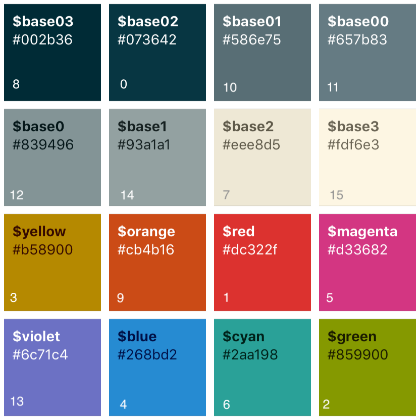

Solarized, without the bullshit.
================================

Unlike Solarized itself, these Vim colorschemes are guaranteed to give consistent results in most environments without littering your beautiful `vimrc` with useless crap or paging through hundreds of StackOverflow questions to make sense of a needlessly convoluted setup.

## Requirements

### GUI

You don’t need to do anything for these colorschemes to work in GVim or MacVim.

### TUI

Flattened’s only requirement is the same as Solarized: that you change your terminal emulator’s so-called “ASCII” colors to the ones used by Solarized.

The reason is simple. Most terminal nowadays are capable of displaying 256 colors but *none* of the colors used in the Solarized palette can be found in the semi-standard Xterm palette. Therefore, we are forced to assign the Solarized non-standard values to colors 0 through 15 of our terminal emulator if we want to see the actual Solarized colors instead of poor approximations.

The exact method depends on your terminal emulator. I’d suggest simply using the values from this table and call it a day:

    TERMCOL   HEX     RGB
    -------   ------- -----------
    black     #073642   7  54  66
    red       #dc322f 220  50  47
    green     #859900 133 153   0
    yellow    #b58900 181 137   0
    blue      #268bd2  38 139 210
    magenta   #d33682 211  54 130
    cyan      #2aa198  42 161 152
    white     #eee8d5 238 232 213

    brblack   #002b36   0  43  54
    brred     #cb4b16 203  75  22
    brgreen   #586e75  88 110 117
    bryellow  #657b83 101 123 131
    brblue    #839496 131 148 150
    brmagenta #6c71c4 108 113 196
    brcyan    #93a1a1 147 161 161
    brwhite   #fdf6e3 253 246 227
    

## Installation

Put `flattened_dark.vim` and/or `flattened_light.vim` in `~/.vim/colors/` (on unix-like systems) or `%userprofile%\vimfiles\colors\` (on Windows).

## Configuration

What do you want to configure? It’s a freaking colorscheme!

## Usage

If you want the “dark” version:

    :color flattened_dark

If you want the “light” version:

    :color flattened_light

If you like what you see and decide to make flattened your default colorscheme, add the relevant line to your `vimrc`:

    colorscheme flattened_light

or:

    colorscheme flattened_dark

## Screenshots or it didn’t happen

### MacVim

### iTerm

